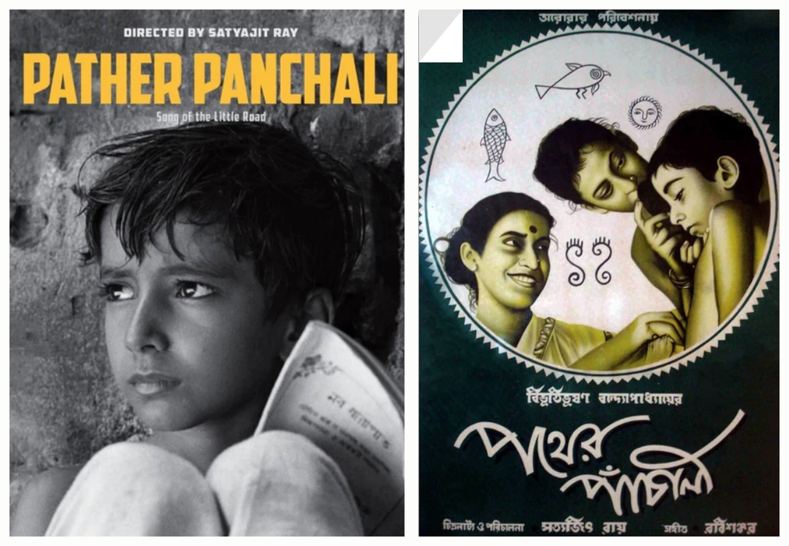
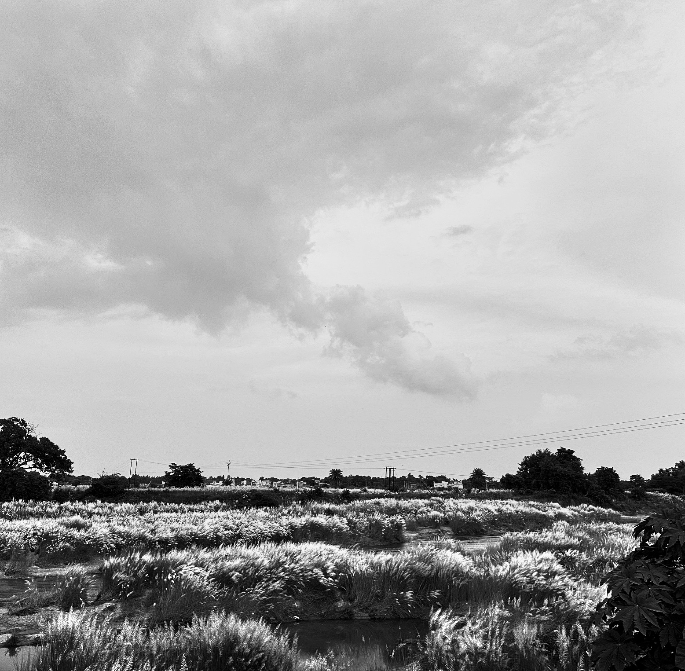

---
---

```{=html}
<link
  rel="stylesheet"
  href="https://fonts.googleapis.com/css2?family=Noto+Serif+Bengali:wght@400;500;600&display=swap"
>

<div class="books-page">

    <a
  class="beyond-back"
  href="beyond.html"
  aria-label="Back"
  title="Back"
>←</a>

  <!-- OPENING -->

  <header class="books-opening">

    <div class="books-title">
      Books, lately.
    </div>

  </header>

  <!-- READING LOG -->

  <section class="books-log">

    <details class="books-entry" open>

      <summary class="books-entry-summary">

        <span class="books-entry-date">
          15 SEPTEMBER 2026
        </span>

        <span class="books-entry-summary-title">
          On the current pile
        </span>

        <span class="books-entry-toggle"></span>

      </summary>

      <div class="books-entry-body">

        <!-- CURRENTLY READING -->

        <div class="books-current-grid">

          <div class="books-current-copy">

            <div class="books-small-label">
              CURRENTLY READING
            </div>

            <div class="books-book-title">

              <span class="books-bengali">
                অনুবর্তন
              </span>

              <span class="books-roman-title">
                Anuborton
              </span>

              <span class="books-translation">
                roughly, “Following”
              </span>

            </div>

            <div class="books-author">
              Bibhutibhushan Bandyopadhyay
            </div>

            <p>
              You may not immediately recognise Bibhutibhushan by name,
              but you may know the story that travelled furthest from his
              pages:

              <span
                class="books-poster-trigger"
                tabindex="0"
              >
                <span class="books-bengali">পথের পাঁচালী</span>
                <em>Pather Panchali</em>

                <span class="books-poster-popover">
                  
                  <span>
                    <em>Pather Panchali</em>
                  </span>
                </span>
              </span>,

              usually rendered in English as <em>Song of the Road</em>,
              and in French as <em>La Complainte du sentier</em>, directed by Satyajit Ray.
            </p>

            <p>
              What I love about Bibhutibhushan is not simply his eye for
              rural Bengal. He makes hardship beautiful without making it
              less hard. Ordinary struggles, family ties, small economies,
              disappointments and grief acquire enormous emotional weight
              in his hands.
            </p>

            <p>
              I grew up in Bankura, a small town in West Bengal, so his
              village paths, fields, households and small-town rhythms can
              feel almost too familiar. Sometimes recognition arrives
              before interpretation. The distance between the page and
              memory simply disappears.
            </p>

            <p>
              <em>Anuborton</em> turns that attention towards the teachers
              of a school in Kolkata during the years of the Second World
              War. These are poorly paid people with ordinary ambitions,
              compromises, affections and disappointments. Yet he makes
              their apparently small lives feel large enough to contain
              an entire world.
            </p>

          </div>

          <figure class="books-kash-figure">

            

         <figcaption>
  Bankura, West Bengal. Kash phool (wild sugarcane) below, and a cloud that
  looks uncannily like train smoke above. It was difficult not
  to see a little of <em>Pather Panchali</em> in the frame.

  <span class="photo-credit books-photo-credit">
    Photo © Swapnanil SenGupta
  </span>
</figcaption>

          </figure>

        </div>

        <!-- JUST FINISHED -->

        <div class="books-finished">

          <div class="books-finished-label">
            JUST BEFORE THIS
          </div>

          <div class="books-finished-content">

            <div class="books-finished-title">
              <em>Disgrace</em>
              <span>J. M. Coetzee</span>
            </div>

            <p>
              A disgraced professor retreats from one crisis only to find
              himself confronting another alongside his daughter in
              post-apartheid South Africa. It is gripping, uncomfortable,
              and deliberately difficult to settle into.
            </p>

            <p>
              While reading it, I kept finding Lucy infuriatingly stubborn.
              Only after I put the book back on the shelf did something
              bother me about that judgement. I had been reading her,
              at least partly, through David's frustration with her.
              The book had managed to leave me questioning both her
              choices and the position from which I had judged them.
            </p>

          </div>

        </div>

      </div>

    </details>

  </section>

  <!-- ONE THAT STAYS PERSONAL -->

  <section class="books-memory">

<div class="books-memory-photo">

  

  <div class="photo-credit books-memory-credit">
    Photo © Swapnanil SenGupta
  </div>

</div>

    <div class="books-memory-copy">

      <div class="books-memory-label">
        ONE I DON'T QUITE REVIEW
      </div>

      <p>
        Some books acquire meanings that have very little to do with
        reviewing them.
        André Aciman's
        <span class="books-memory-book">
          The Gentleman from Peru
        </span>
        is one of mine.
      </p>

      <p class="books-memory-last">
        That story can wait for a longer conversation.
      </p>

    </div>

  </section>

  <!-- ENDING -->

  <footer class="books-ending">

    <div class="books-ending-mark">
      ✦
    </div>

    <p>
      I got the habit from my mother. Perhaps that is why books have
      always felt like  things I carry with me.
    </p>

  </footer>

</div>
```

