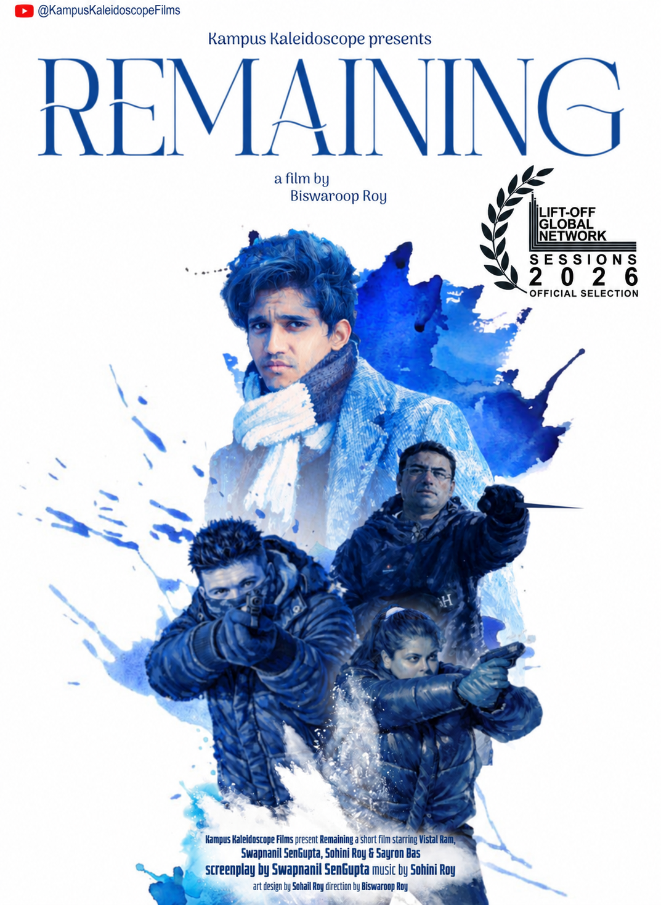
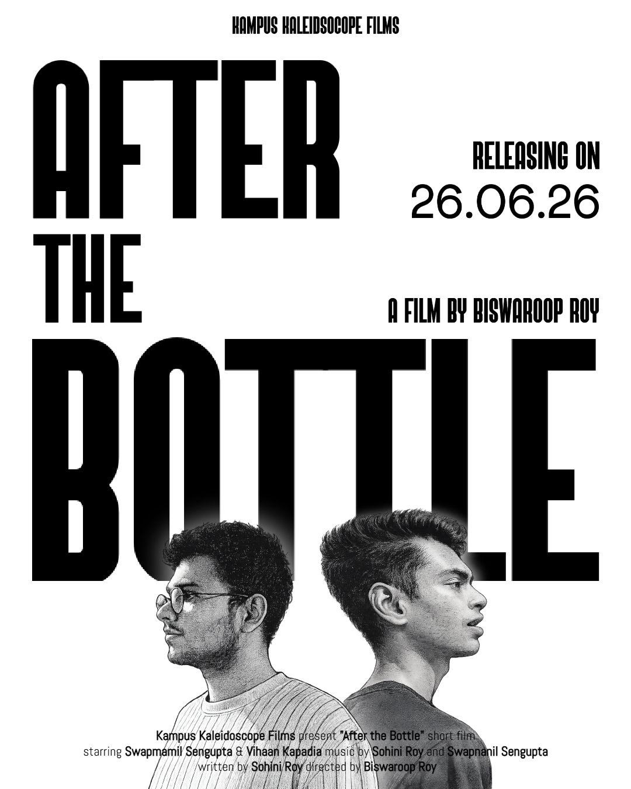

---
---

```{=html}
<div class="film-page">

  <section class="film-hero">

    <div class="film-copy">

      <div class="film-title">
        Scenes in my head,<br>
        <span>occasionally on a screen.</span>
      </div>

      <div class="film-intro">

        <p>
          I have recently started teaching myself screenwriting in the most
          straightforward way I could think of (by writing screenplays).
          What interests me most is building stories and finding their form
          on screen, although I am equally happy starting with someone
         else’s story and working out how best to tell it.
        </p>

        <p>
          I also somehow ended up acting in both films below. Small
          productions occasionally have a very practical definition of
          casting: <em>who is available?</em>
        </p>

      </div>

    </div>


    <div class="film-posters">

      <a
        class="film-poster film-poster-one"
        href="https://www.youtube.com/watch?v=DZ1AsbRUFtg&list=LL&index=87&t=172s"
        target="_blank"
        rel="noopener"
      >

        <div class="film-poster-image">

          

          <div class="film-watch">
            Watch on YouTube ↗
          </div>

        </div>

        <div class="film-poster-caption">

          <span class="film-name">
            Remaining
          </span>

          <span class="film-role">
            Screenplay · Acting
          </span>

        </div>

      </a>


      <a
        class="film-poster film-poster-two"
        href="https://www.youtube.com/watch?v=NlGqXbDVgDE&list=LL&index=10"
        target="_blank"
        rel="noopener"
      >

        <div class="film-poster-image">

          

          <div class="film-watch">
            Watch on YouTube ↗
          </div>

        </div>

        <div class="film-poster-caption">

          <span class="film-name">
            After the Bottle
          </span>

          <span class="film-role">
            Screenplay · Acting · Music
          </span>

        </div>

      </a>

    </div>

  </section>


  <section class="film-writing">

    <div class="film-writing-heading">
      On the page
    </div>


    <div class="film-writing-grid">

      <div class="film-script">

        <div class="film-script-number">
          01
        </div>

        <div class="film-script-status">
          COMPLETE
        </div>

        <div class="film-script-title">
          Bhorer Aage <span style="font-weight:400; font-style:italic;">(Before the Dusk)</span>
        </div>

        <div class="film-script-description">
          An intimate Bengali-English story about friendship, grief and the
          things people sometimes leave behind without quite saying them.
        </div>

      </div>


      <div class="film-script">

        <div class="film-script-number">
          02
        </div>

        <div class="film-script-status">
          IN PROGRESS
        </div>

        <div class="film-script-title">
          Another one is taking shape.
        </div>

        <div class="film-script-description">
          A contained ensemble story that begins with an anniversary and
          gradually wanders into neo-noir territory. That is probably enough
          to put on the internet for now.
        </div>

      </div>

    </div>

  </section>


  <a class="film-collab" href="contact.html">

    <div class="film-collab-small">
      HAVE A CAMERA, A CREW, OR A STORY?
    </div>

    <div class="film-collab-main">
      If you’d like to help bring one of these screenplays to life, or gather a crew, drop me a line.
    </div>

    <div class="film-collab-sub">
      I’m equally open to other stories worth building.
    </div>

    <div class="film-collab-arrow">
      ↗
    </div>

  </a>

</div>
```