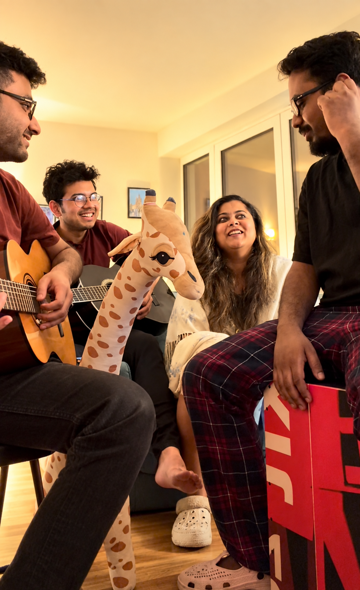
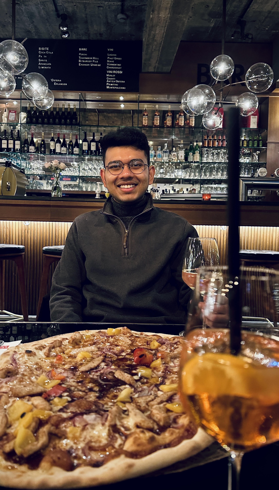
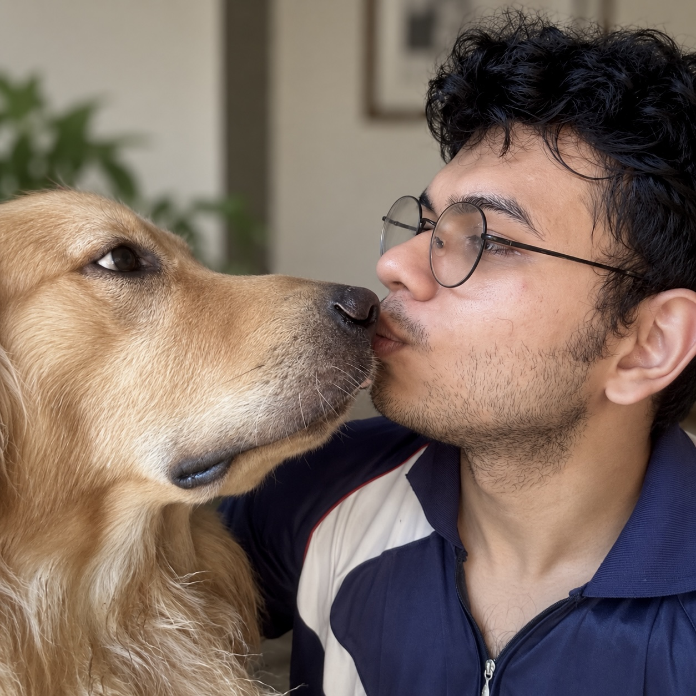

---
---

```{=html}
<div class="misc-page">
      <a
  class="beyond-back"
  href="beyond.html"
  aria-label="Back"
  title="Back"
>←</a>


  <header class="misc-opening">

    <div class="misc-heading">
      The rest of the day.
    </div>

  </header>


  <!-- MUSIC -->

  <section class="misc-music">

    <div class="misc-band-photo">
      
    </div>

    <div class="misc-music-copy">

      <div class="misc-section-heading">
        A guitar, a few friends, an evening.
      </div>

      <p>
        I play the guitar casually, mostly in close gatherings. I like
        what a few chords can do to an evening, setting a rhythm, lifting
        the mood, or simply becoming part of whatever is already happening
        around the room. I am still learning, and I would like to become
        much better at it.
      </p>

      <p>
  These days I play with friends in a band called
  <span class="sutra-trigger" tabindex="0">
    <em>Sutra</em>
    <span class="sutra-popover" aria-hidden="true">
      
    </span>
  </span>.
  Much of our music grows out of <em>adda</em>, which is probably
  the most natural setting I can imagine for it.
</p>

    </div>

  </section>


  <!-- ADDA -->

  <section class="misc-adda">

    <div class="misc-adda-word">
      adda
    </div>

    <div class="misc-adda-copy">

      <p>
        <em>Adda</em> is one of those Bengali words that loses something
        in translation. It is less an activity than a way of spending time
        together. A peaceful evening stretches out over tea and food,
        laughter, arguments, and conversations that wander from politics
        to literature, cinema, gossip, music and back again.
      </p>

      <p>
        In ours, someone eventually reaches for an instrument and the
        conversation simply finds another soundtrack.
      </p>

    </div>

  </section>


  <!-- GAMING -->

  <section class="misc-gaming">

    <div class="misc-gaming-head">

      <div class="misc-gaming-label">
        VIDEO GAMES
      </div>

      <div class="misc-section-heading misc-gaming-heading">
        The hardware improved.<br>
        The habit stayed.
      </div>

    </div>

    <div class="misc-gaming-copy">

      <p>
        I started gaming on my fifth birthday, when my father gave me one
        of those cartridge-based 8-bit TV consoles that plugged straight
        into the television. It became one of those childhood gifts that
        quietly stuck.
      </p>

      <p>
        These days I move between PC and PlayStation, mostly through
        single-player games and the big franchises I grew up with. What
        usually keeps me interested is the same thing that pulls me into
        books and films, a world with enough detail and atmosphere to
        disappear into for a while.
      </p>

    </div>

  </section>


  <!-- SMALL MOMENTS -->

  <section class="misc-snapshots">

    <div class="misc-snapshot misc-snapshot-pizza">
      
    </div>

    <div class="misc-snapshot misc-snapshot-dog">
      
    </div>

  </section>


  <!-- NOVEL -->

  <section class="misc-sidequest">

    <div class="misc-sidequest-label">
      SIDE QUEST
    </div>

    <div class="misc-sidequest-text">
      Somewhere between all of this, I am also trying to write a novel.
      <span>“Trying” is doing important work in that sentence.</span>
    </div>

  </section>


  <!-- END -->

  <footer class="misc-ending">

    <div class="misc-ending-mark">
      ✦
    </div>

    <p>
      I am also trying to get better at having interests that do not
      immediately need to become projects.
    </p>

  </footer>

</div>
```