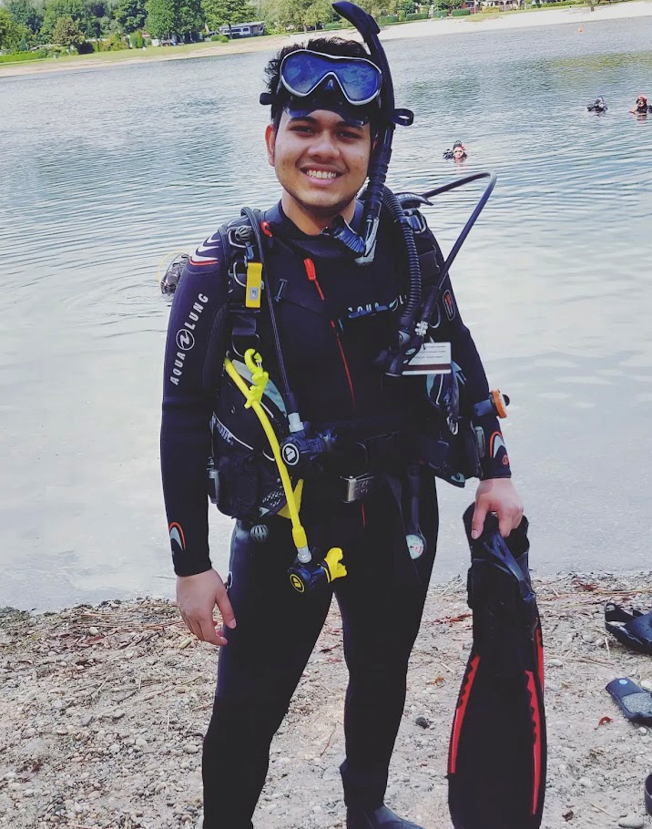
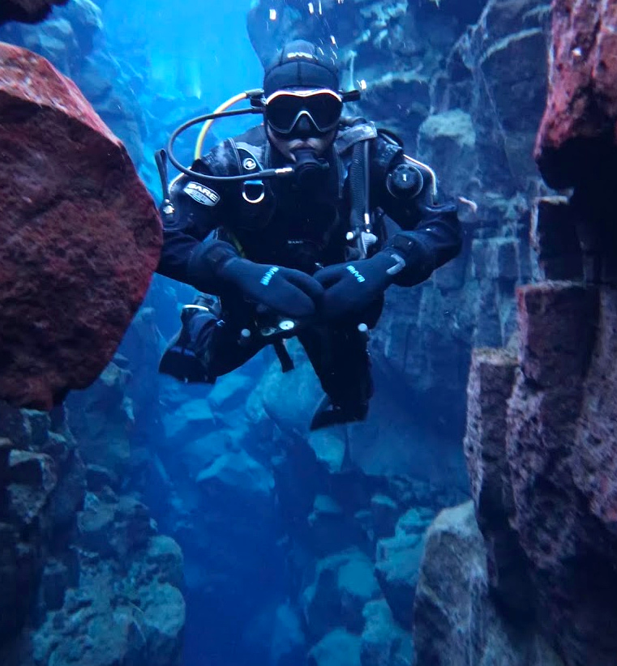
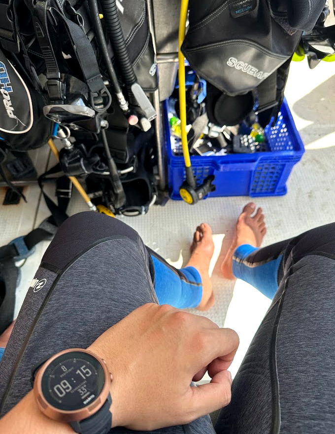
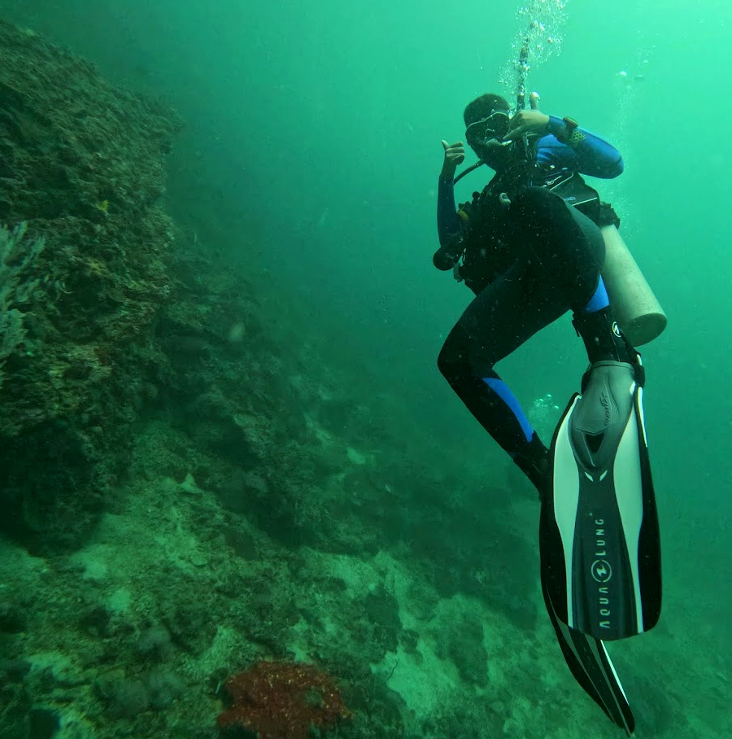

---
---

```{=html}
<div class="scuba-page">

      <a
  class="beyond-back"
  href="beyond.html"
  aria-label="Back"
  title="Back"
>←</a>


  <!-- OPENING -->

  <header class="scuba-opening">

    <div class="scuba-title">
      A few metres below sea level.
    </div>

    <div class="scuba-qualification-line">
      Advanced Open Water Diver
      <span>·</span>
      Dry Suit Diver
    </div>

  </header>


  <!-- BEGINNING -->

  <section class="scuba-beginning">

    <div class="scuba-beginning-copy">

      <div class="scuba-small-label">
        HOW IT STARTED
      </div>

      <p class="scuba-lead">
        I grew up fascinated by aquariums, so scuba had been sitting
        somewhere on my list for years.
      </p>

      <p>
        Then
        <span
          class="scuba-film"
          title="If you haven't seen it, I recommend it, regardless of language."
        ><em>Zindagi Na Milegi Dobara</em></span>
        made the idea considerably harder to ignore. Eventually I decided
        to learn properly, trained in Germany, and never really looked back.
      </p>

      <p>
        What began as something I wanted to try once has quietly become
        one of the ways I decide where to go next.
      </p>

    </div>


    <div class="scuba-shore-photo">
      
    </div>

  </section>


  <!-- UNDERWATER -->

  <section class="scuba-water">

    <div class="scuba-blue-photo">
      
    </div>


    <div class="scuba-green-block">

      <div class="scuba-gear-photo">
        
      </div>

      <div class="scuba-green-photo">
        
      </div>

      <div class="scuba-water-note">
        Turns out, a considerable part of the world is better viewed
        a few metres below sea level.
      </div>

    </div>

  </section>


  <!-- TRAVEL -->

  <section class="scuba-travel">

    <div class="scuba-travel-heading">
      The map changed too.
    </div>

    <div class="scuba-travel-copy">

      <p>
        Travel came first. My first trip outside India was to Russia
        with my dad for the 2018 World Cup, and it remains one of my
        fondest travel memories.
      </p>

      <p>
        Since then I have mostly travelled solo. Somewhere along the way,
        dive sites started influencing the itinerary. Now a place becomes
        considerably more tempting when there is something interesting
        beneath the water as well.
      </p>

    </div>

  </section>


  <!-- MAP -->

  <section class="scuba-map-section">

    <div class="scuba-map-heading">

      <div class="scuba-map-title">
        Where I have wandered so far
      </div>

      <div class="scuba-map-legend">

        <div class="scuba-legend-item">
          <span class="scuba-legend-swatch travelled"></span>
          Travelled
        </div>

        <div class="scuba-legend-item">
          <span class="scuba-legend-swatch dived"></span>
          Dived
        </div>

      </div>

    </div>


    <div
      id="scuba-world-map"
      class="scuba-world-map"
      aria-label="Interactive world map of countries visited and scuba destinations"
    ></div>

  </section>


  <!-- ENDING -->

  <footer class="scuba-ending">

    <div class="scuba-ending-mark">
      ✦
    </div>

    <p>
      The world gets wonderfully quiet down there.
      For a while, whatever followed you from land seems to lose its grip.
    </p>

  </footer>

</div>


<script src="https://cdn.plot.ly/plotly-2.35.2.min.js"></script>

<script>
window.addEventListener("load", function () {

  const travelledCountries = [
    "IND",
    "RUS",
    "GBR",
    "NLD",
    "CZE",
    "POL",
    "AUT",
    "HUN",
    "PRT",
    "ROU",
    "DEU",
    "HRV",
    "MLT",
    "ISL",
    "ARE",
    "QAT",
    "THA",
    "GRC"
  ];


  const travelledNames = [
    "India",
    "Russia",
    "United Kingdom",
    "Netherlands",
    "Czech Republic",
    "Poland",
    "Austria",
    "Hungary",
    "Portugal",
    "Romania",
    "Germany",
    "Croatia",
    "Malta",
    "Iceland",
    "United Arab Emirates",
    "Qatar",
    "Thailand",
    "Greece"
  ];


  const scubaCountries = [
    "DEU",
    "HRV",
    "MLT",
    "ISL",
    "THA",
    "GRC"
  ];


  const scubaNames = [
    "Germany",
    "Croatia",
    "Malta",
    "Iceland",
    "Thailand",
    "Greece"
  ];


  const travelTrace = {

    type: "choropleth",

    locationmode: "ISO-3",

    locations: travelledCountries,

    z: travelledCountries.map(() => 1),

    text: travelledNames,

    hovertemplate:
      "%{text}<extra></extra>",

    colorscale: [
      [0, "#9fb9c8"],
      [1, "#9fb9c8"]
    ],

    showscale: false,

    marker: {
      line: {
        color: "#f8faf9",
        width: 0.7
      }
    }

  };


  const scubaTrace = {

    type: "choropleth",

    locationmode: "ISO-3",

    locations: scubaCountries,

    z: scubaCountries.map(() => 1),

    text: scubaNames,

    hovertemplate:
      "%{text}<extra></extra>",

    colorscale: [
      [0, "#214b67"],
      [1, "#214b67"]
    ],

    showscale: false,

    marker: {
      line: {
        color: "#ffffff",
        width: 0.9
      }
    }

  };


  const scubaMarkers = {

    type: "scattergeo",

    mode: "markers",

    lat: [
      51.1,
      45.1,
      35.9,
      64.9,
      15.9,
      39.1
    ],

    lon: [
      10.4,
      15.2,
      14.4,
      -18.6,
      101.0,
      21.8
    ],

    text: [
      "Germany",
      "Croatia",
      "Malta",
      "Iceland",
      "Thailand",
      "Greece"
    ],

    hovertemplate:
      "%{text}<extra></extra>",

    marker: {

      size: 7,

      color: "#214b67",

      line: {
        color: "#ffffff",
        width: 1.4
      }

    },

    showlegend: false

  };


  const layout = {

    margin: {
      l: 0,
      r: 0,
      t: 5,
      b: 0
    },

    paper_bgcolor:
      "rgba(0,0,0,0)",

    plot_bgcolor:
      "rgba(0,0,0,0)",

    geo: {

      projection: {
        type: "natural earth",
        scale: 1.04
      },

      bgcolor:
        "rgba(0,0,0,0)",

      showframe:
        false,

      showcoastlines:
        false,

      showland:
        true,

      landcolor:
        "#e7ecef",

      showocean:
        true,

      oceancolor:
        "#f8fafb",

      showcountries:
        true,

      countrycolor:
        "#ffffff",

      countrywidth:
        0.65

    }

  };


  const config = {

    responsive: true,

    displayModeBar: false,

    scrollZoom: false

  };


  Plotly.newPlot(
    "scuba-world-map",
    [
      travelTrace,
      scubaTrace,
      scubaMarkers
    ],
    layout,
    config
  );

});
</script>
```