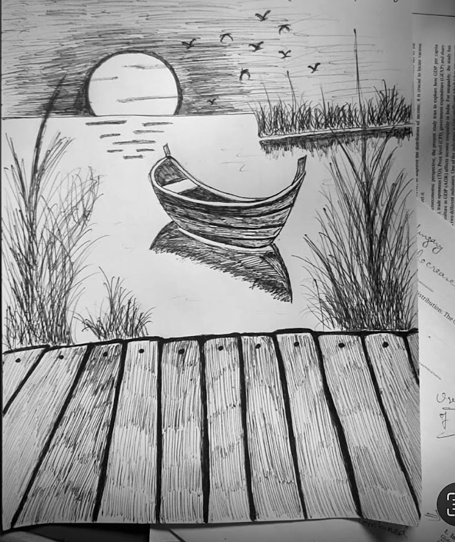
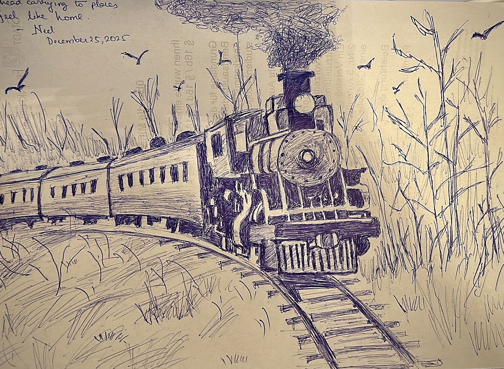
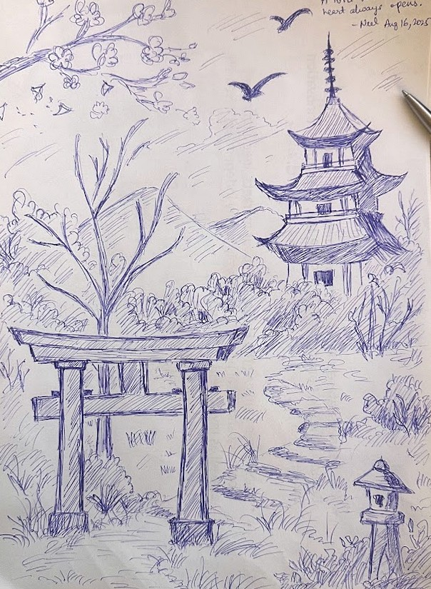
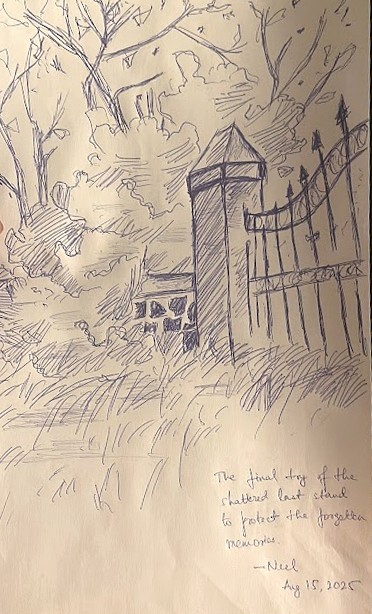
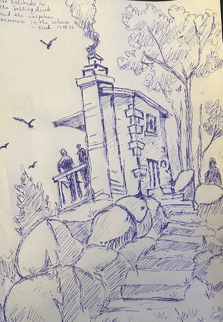
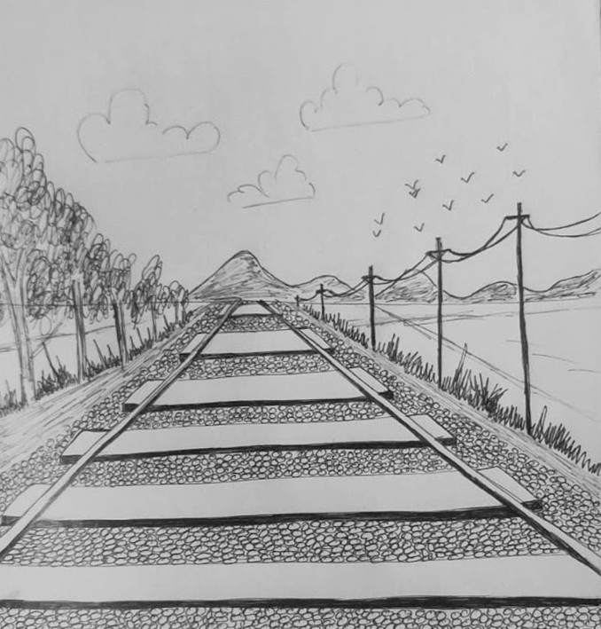

---
---

```{=html}
<div class="sketches-page">

  <header class="sketches-opening">

    <div class="sketches-title">
      Sketchbook.
    </div>

    <div class="sketches-intro">
      I had a little drawing training as a child, mostly because I was too afraid to say no to my mother. Very little
      of that training survived. I came back to sketching much later for
      a different reason that it makes me sit still, look longer, and practise
      patience.
    </div>

  </header>


  <section class="sketches-wall">

    <figure class="sketch-card">
      
    </figure>


    <figure class="sketch-card">
      
    </figure>


    <figure class="sketch-card">
      
    </figure>


    <figure class="sketch-card">
      
    </figure>


    <figure class="sketch-card">
      
    </figure>


    <figure class="sketch-card">
      
    </figure>


    <figure class="sketch-card">
      
    </figure>


    <figure class="sketch-card">
      
    </figure>

  </section>


  <footer class="sketches-ending">

    <div class="sketches-ending-mark">
      ✦
    </div>

    <p>
      Turns out, patience can be practised one line at a time.
    </p>

  </footer>

</div>
```