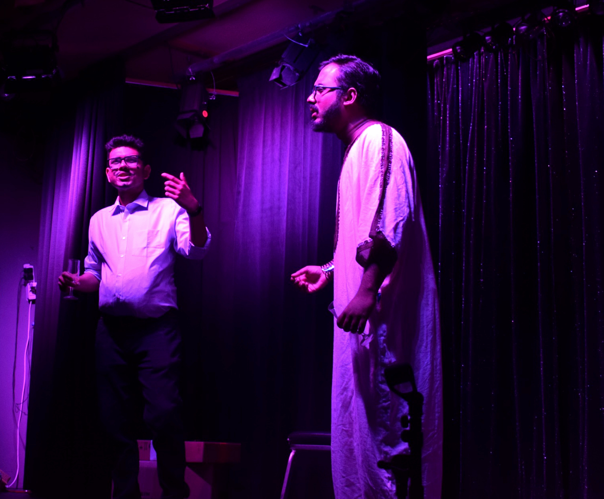
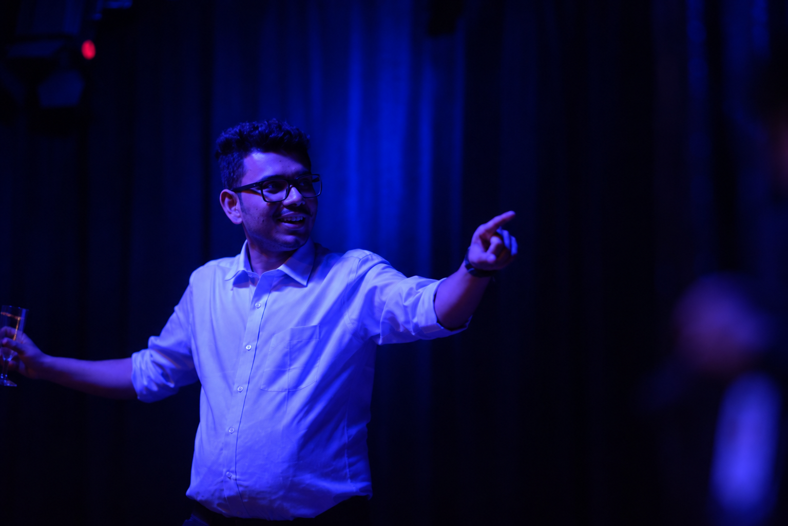
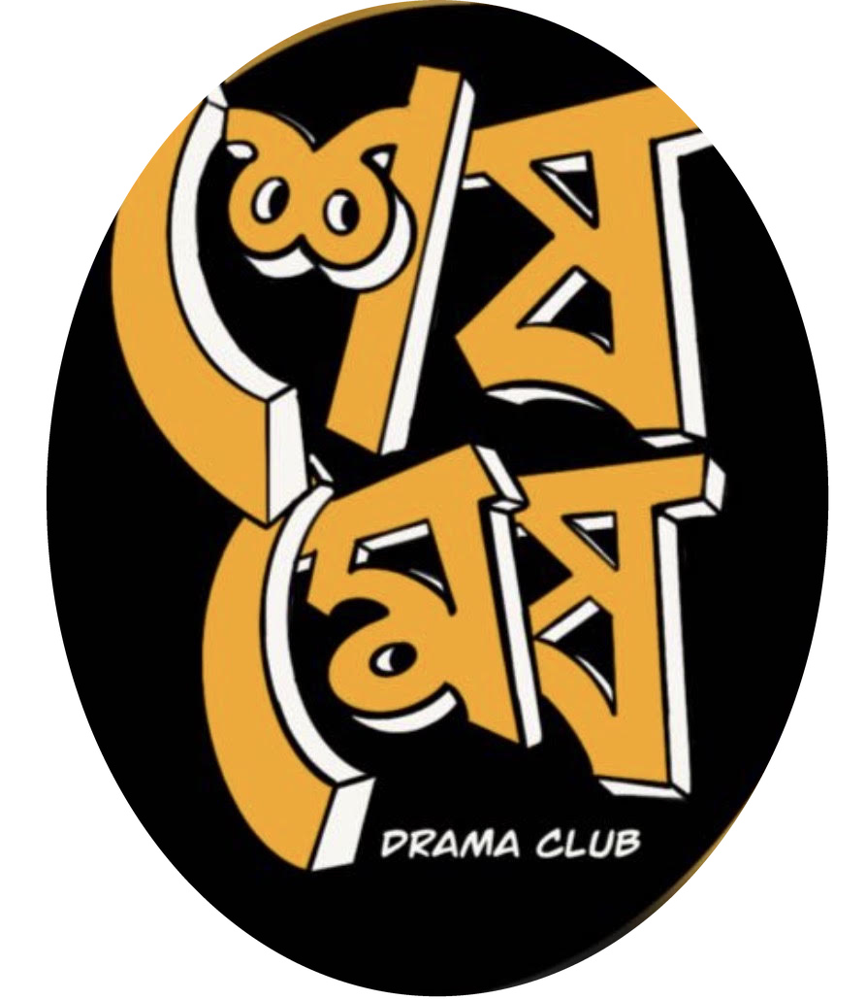
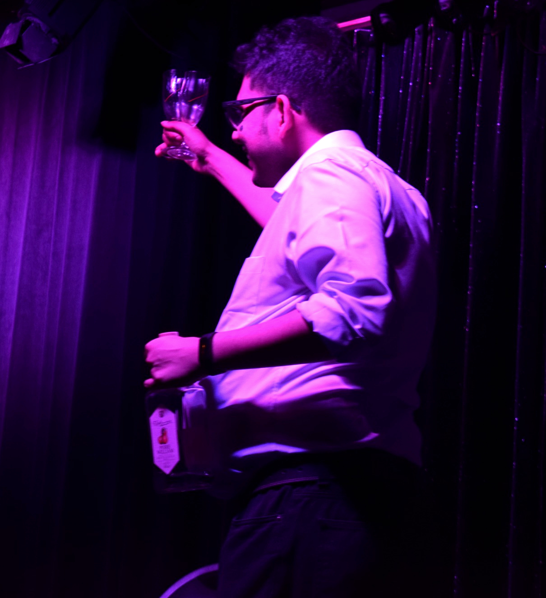
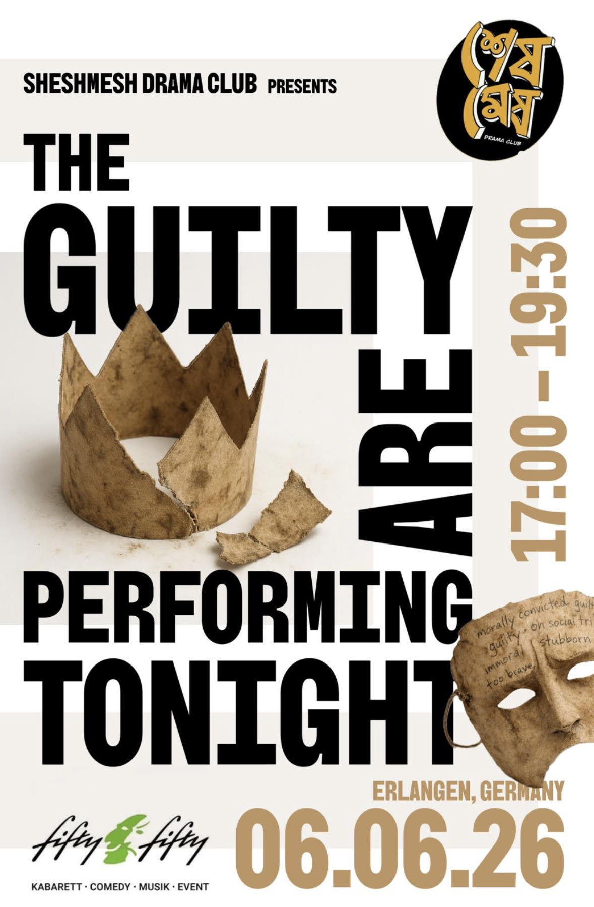

---
---

```{=html}
<div class="theatre-page">

  <section class="theatre-opening">

    <div class="theatre-heading">

      <div class="theatre-title">
        I take direction.<br>
        <span>Very literally.</span>
      </div>

   

    </div>


    <div class="theatre-photo-composition">

      <div class="theatre-photo theatre-photo-main">
        
      </div>

      <div class="theatre-photo theatre-photo-blue">
        
      </div>

    </div>

  </section>


  <section class="theatre-programme">


    <article class="theatre-act theatre-act-one">

      <div class="theatre-act-number">
        ACT I
      </div>

      <div class="theatre-act-title">
        The method
      </div>

      <p>
        I would not claim to be an instinctive actor. I am, however,
        a director’s actor and a very sincere student. Tell me that after
        a particular line I should flinch, scratch my nose with my left
        hand, squint, and then look away, and I will spend rehearsal making
        sure I flinch, scratch, squint and look away in exactly that order.
      </p>

    </article>


    <article class="theatre-act theatre-act-two">

      <div class="theatre-act-number">
        ACT II
      </div>

      <div class="theatre-act-title">
        A long intermission
      </div>

      <p>
        My first appearances on stage were in musicals as a kindergartner.
        Then came a fairly long intermission. Theatre returned after I found

        <span
          class="theatre-hover theatre-hover-logo"
          tabindex="0"
        >
          Shesh Mesh Drama Club

          <span class="theatre-popover">
            
          </span>
        </span>,

        an Erlangen-based registered association (e.V.) and theatre
        community. <em>Shesh mesh</em> roughly translates from Bengali as
        “ultimately” or “in the end”.  Perhaps fittingly, in the end, it gave
         me back a small part of childhood I had left behind.
      </p>

    </article>


    <div class="theatre-programme-photo">

      

      <div class="theatre-photo-caption">
        Somewhere between remembering the lines and trusting the director.
      </div>

    </div>


    <article class="theatre-act theatre-act-three">

      <div class="theatre-act-number">
        ACT III
      </div>

      <div class="theatre-act-title">
        Back under the lights
      </div>

      <p>
        We recently staged our

        <span
          class="theatre-hover theatre-hover-poster"
          tabindex="0"
        >
          first production, <em>The Guilty are Performing Tonight</em>

          <span class="theatre-popover theatre-poster-popover">
            
          </span>
        </span>,

        a satire on greed and fragile ideologies in a futuristic corporate
        setting. We are now working towards the next show.
      </p>

    </article>


  </section>


  <div class="theatre-cue">
    Director’s notes: binding, not advisory.
  </div>

</div>
```